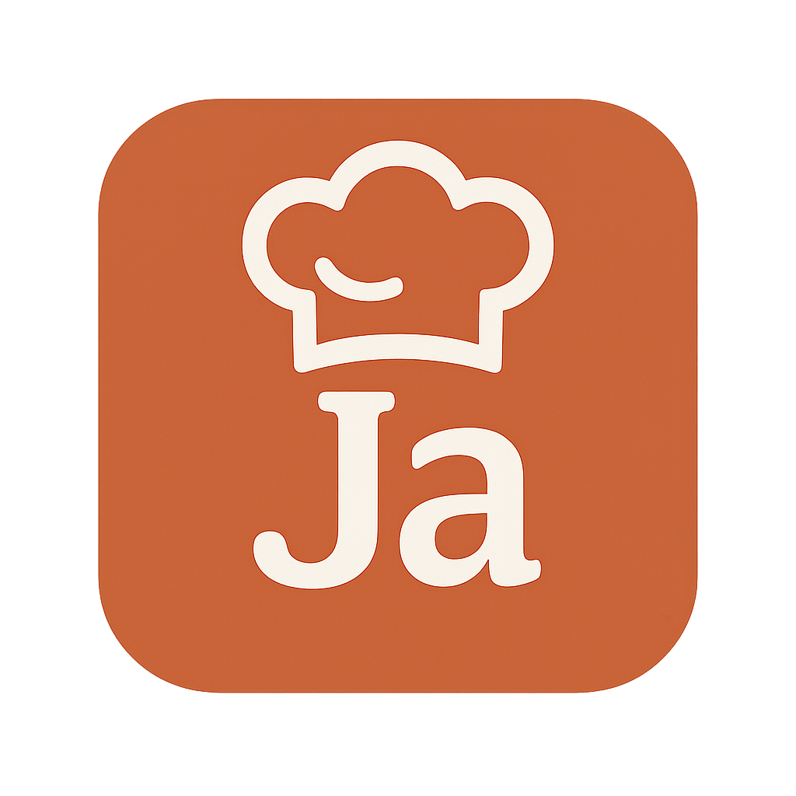

# 🍽️ Recetas de Cocina App

Una aplicación web que permite a los usuarios buscar y visualizar recetas de cocina utilizando la API pública [TheMealDB](https://www.themealdb.com/).

## 🚀 Demo en vivo

Accede a la app en línea aquí:  
👉 [https://recetas-de-cocina-app.vercel.app](https://recetas-de-cocina-app.vercel.app)

---

## 🧰 Tecnologías utilizadas

- React.js
- JavaScript (ES6)
- HTML & CSS
- API REST: [TheMealDB](https://www.themealdb.com/)
- Vercel (deploy)

---

## 📦 Funcionalidades

### 🔍 Búsqueda de recetas
- Campo de búsqueda que permite buscar recetas por nombre.
- Muestra resultados mientras se escribe.

### 📂 Listado por categoría
- Carga automática de categorías desde la API.
- Por defecto se muestran las recetas de la categoría **"Dessert"**.
- El usuario puede cambiar de categoría desde un menú desplegable.

### 📄 Detalles de la receta
- Al hacer clic en una receta, se muestra una página con:
  - Imagen de la receta
  - Nombre, categoría y área
  - Ingredientes con sus medidas
  - Instrucciones paso a paso

### 🎨 Estilo visual
- Fondo con imagen de cocina (`fondo.png`)
- Logo personalizado (`logo_app.png`)

---

## 🛠️ Cómo ejecutar localmente

1. Clona el repositorio:

git clone https://github.com/JJAM2005/Recetas-de-cocina-app
cd recetas-de-cocina-app

2. Instala dependencias:

npm install

3. Inicia el servidor de desarrollo:

npm start
La app se abrirá en: http://localhost:3000

---

## 📝 Autor

Desarrollado por Jairo Angulo
💼 Técnico en programación de software — SENA

---

